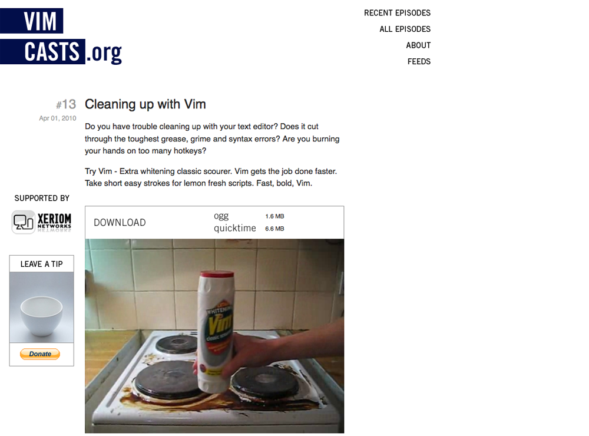
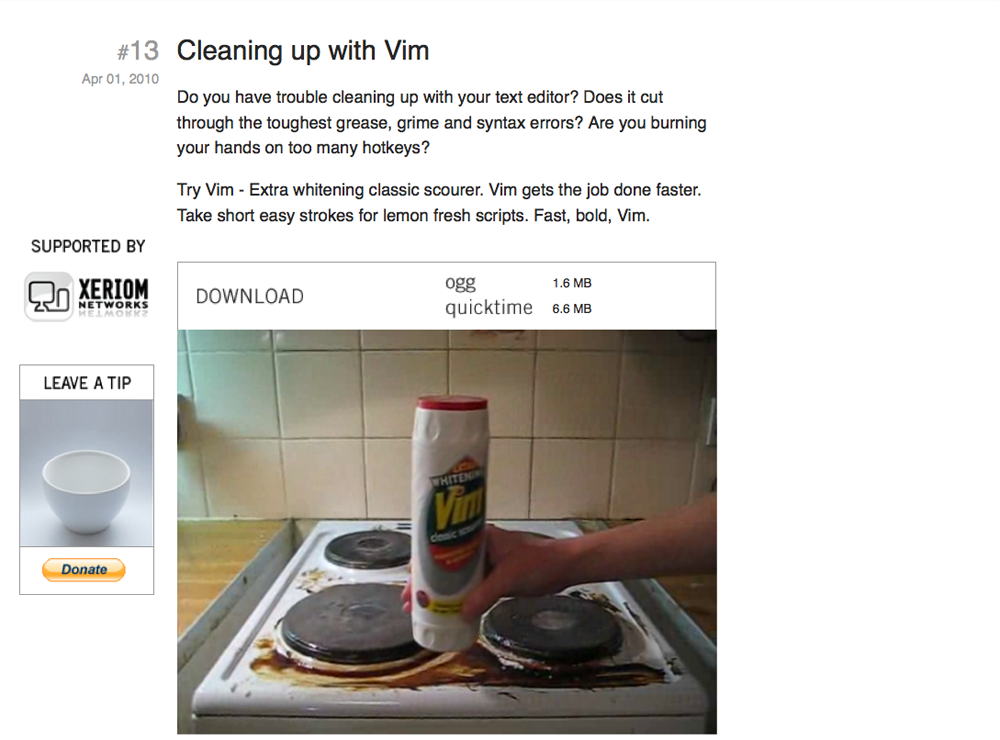
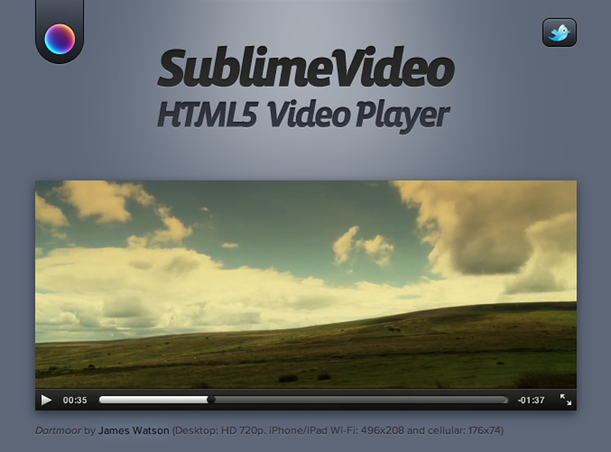
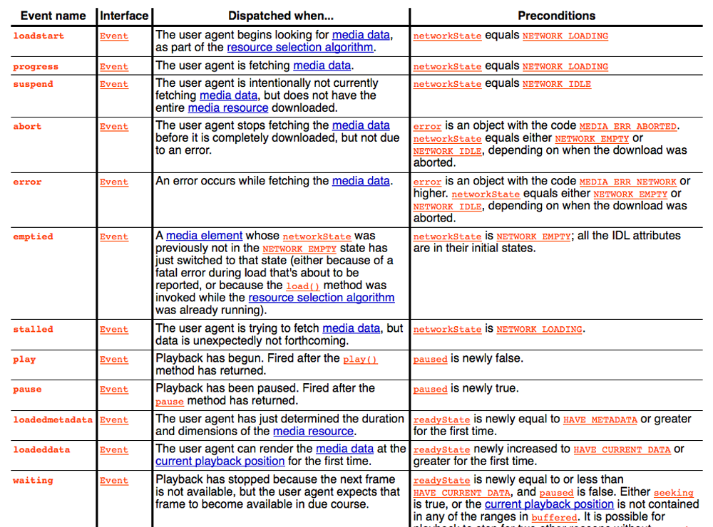
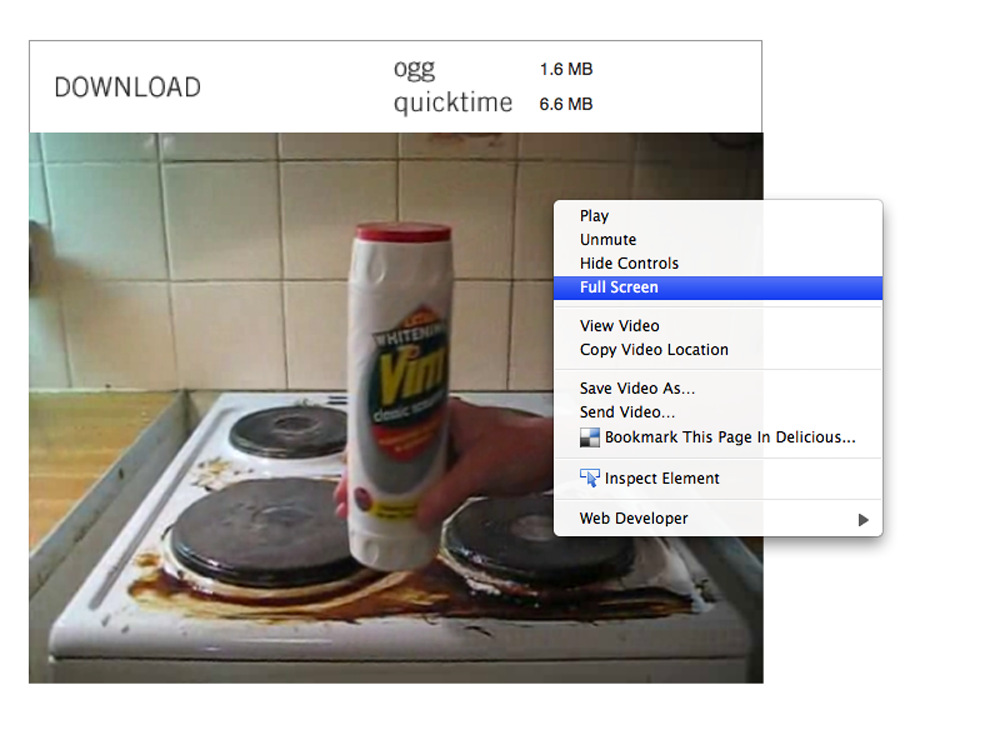
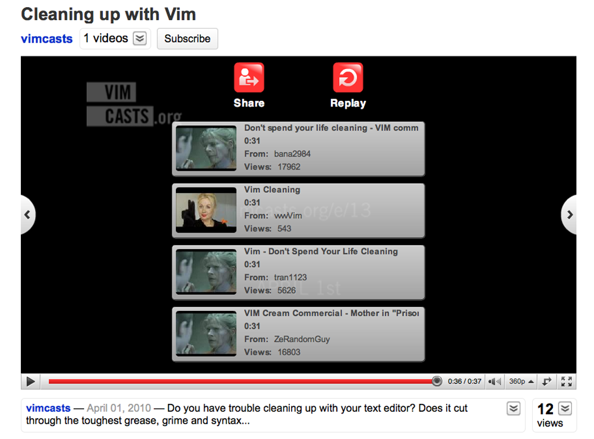

!SLIDE
# BENEFITS

!SLIDE bullets incremental small
## BENEFITS

* Native - works with page zoom
* Style with CSS
* Script with JavaScript
* Integration with \<canvas\>
* Low CPU usage
* Future proof

!SLIDE
## PAGE ZOOM

!SLIDE
     

!SLIDE
     

!SLIDE
## STYLE WITH CSS
!SLIDE
     

!SLIDE
## SCRIPT WITH JAVASCRIPT
!SLIDE
     

!SLIDE bullets incremental
## CUSTOM CONTROLS

* \<html\> elements needn't overlap video frame
* brand your buttons (e.g. Fischer Price)
* \<ul\> of chapter markers

!SLIDE
## FUTURE PROOF

!SLIDE

 !SLIDE

!SLIDE
## INTEGRATION WITH \<CANVAS\>

!SLIDE smaller

## canvas.drawImage()

    @@@javascript
    var canvas = document.getElementById('canvas').getContext('2d');
    var video = document.getElementsByTagName('video')[0];
    video.onloadeddata = function(e) {
      canvas.drawImage(video, 0, 0);
    }

!SLIDE

!SLIDE

