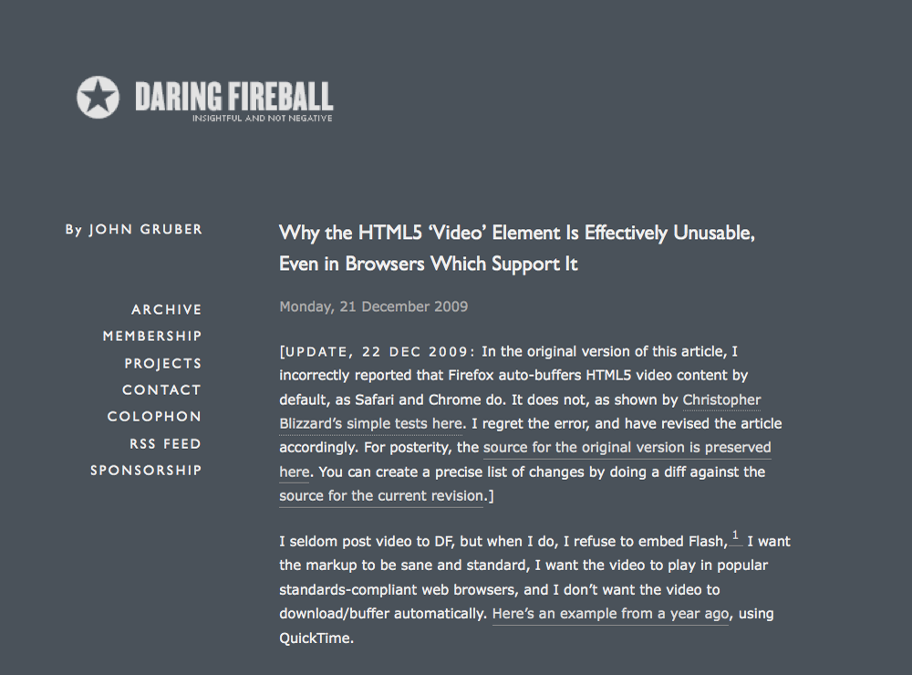

!SLIDE
#PRACTICALITIES

!SLIDE
#ENCODING

!SLIDE bullets incremental
## On OS X

* encode h.264 with Quicktime
* encode ogg with [ffmpeg2theora](http://v2v.cc/~j/ffmpeg2theora/download.html)
* politics

!SLIDE bullets incremental
## FFMPEG2THEORA

* command line utility
* available for Windows, Linux & OS X

!SLIDE
#CONTENT-TYPE

!SLIDE
##FIREFOX IS FUSSY!

!SLIDE bullets incremental
##FIREFOX IS FUSSY

* content-type="video/ogg"
* .ogv/.ogg extension doesn't matter

!SLIDE
# AUTOBUFFER

!SLIDE

!SLIDE bullets incremental
## AUTOBUFFER
* Safari/Chrome (webkit) don't honor "autobuffer"
* Firefox buffers head for poster frame
* Who pays for the bandwidth?

!SLIDE
### I READ YOUTUBE
### BUT ONLY FOR THE COMMENTS

!SLIDE smaller

    @@@html
    

    

!SLIDE smaller

    @@@javascript
    $(document).ready(function() {
      $("img.placeholder").click(function() {
        var episode_number = 
          this.id.match(/(episode_\d+)_placeholder/)[1];
  
        var metadata = window[episode_number];
  
        $(this).replaceWith("<video height='" + this.height +
          "' width='" + this.width + "' poster='" + this.src + 
          "' controls autoplay><source src='" + metadata.mov + 
          "' type='video/mp4'/><source src='" + metadata.ogg + 
          "' type='video/ogg'/></video>");
      });
    });
    
